<div align="center">
  
</div>

<div align="center">
  
</div>

<p align="center">
  <a href="https://williamjiamin.github.io"></a>
  <a href="https://github.com/williamjiamin?tab=repositories"></a>
  <a href="https://github.com/williamjiamin?tab=followers"></a>
</p>

<p align="center">
  
</p>

## Hi, I am William

I use GitHub as a public workshop: part portfolio, part learning archive, and part product playground.

I build across AI, iOS, Python, education, and creative tooling. A lot of my work is about taking something complex and making it feel approachable, useful, and a little more beautiful.

<p align="center">
  
  
  
  
  
  
</p>

## What this profile is about

- Building products that mix utility, personality, and thoughtful UX.
- Sharing educational code that makes technical ideas easier to learn.
- Exploring the overlap between software, creativity, and digital storytelling.

## Featured builds

<table>
  <tr>
    <td width="50%" valign="top">
      <h3><a href="https://github.com/williamjiamin/SimpleBible">SimpleBible</a></h3>
      <p>An iOS Bible app with AI study guidance, voice reading, semantic search, and daily verses.</p>
    </td>
    <td width="50%" valign="top">
      <h3><a href="https://github.com/williamjiamin/Simple-Pattern">Simple-Pattern</a></h3>
      <p>A more design-forward iOS utility with custom patterns, privacy-minded features, and a polished product feel.</p>
    </td>
  </tr>
  <tr>
    <td width="50%" valign="top">
      <h3><a href="https://github.com/williamjiamin/GetMeJarvis">GetMeJarvis</a></h3>
      <p>A shortcut-driven way to make ChatGPT more accessible through Siri and everyday voice interactions.</p>
    </td>
    <td width="50%" valign="top">
      <h3><a href="https://github.com/williamjiamin/Pure_Python_for_DS_ML">Pure Python for DS and ML</a></h3>
      <p>A learning-focused repository for data science and machine learning built in approachable, plain Python.</p>
    </td>
  </tr>
  <tr>
    <td width="50%" valign="top">
      <h3><a href="https://github.com/williamjiamin/Quant_Intro">Quant Intro</a></h3>
      <p>Python notebooks and notes that translate quantitative finance ideas into something learners can actually follow.</p>
    </td>
    <td width="50%" valign="top">
      <h3><a href="https://github.com/williamjiamin/williamjiamin.github.io">Personal Website</a></h3>
      <p>A lightweight home for my developer presence, experiments, and public-facing projects.</p>
    </td>
  </tr>
</table>

## Current direction

```text
AI-assisted apps   -> useful, calm, human-centered experiences
Education projects -> practical repos that lower the learning curve
Creative coding    -> interfaces and tools with a stronger visual identity
```

## GitHub pulse

<div align="center">
  
  
</div>

<div align="center">
  
</div>

## Snapshot

<table>
  <tr>
    <td width="50%" valign="top">
      <strong>Build style</strong><br />
      Clear UX, practical features, and public-facing experiments that feel polished instead of generic.
    </td>
    <td width="50%" valign="top">
      <strong>Main lanes</strong><br />
      AI apps, iOS products, Python education, and creative developer tools.
    </td>
  </tr>
</table>

## Around the web

<p align="center">
  <a href="https://williamjiamin.github.io"></a>
  <a href="https://www.patreon.com/CodeWithWilliamJiamin"></a>
  <a href="https://www.patreon.com/Williamjiamin"></a>
</p>

<p align="center">
  If you like thoughtful products, learning-first tools, or creative tech experiments, you will probably enjoy what I am building here.
</p>
